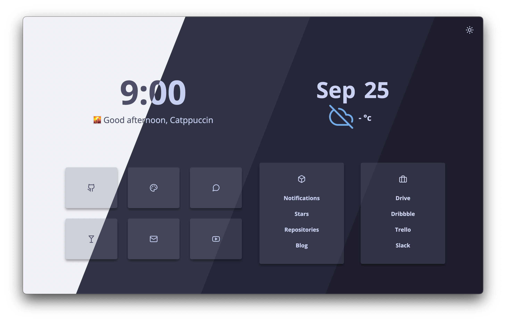

<h3 align="center">
   
  
  Catppuccin for <a href="https://github.com/lewisdoesstuff/Bento/tree/themes">Bento</a>
  
</h3>

  
  
  

  

&nbsp;

## ⚙️ Usage

1. Clone [lewisdoesstuff's Bento Fork](https://github.com/lewisdoesstuff/Bento/tree/themes) with `git clone -b themes https://github.com/lewisdoesstuff/Bento.git`
2. Clone this repository with `git clone https://github.com/catppuccin/bento BentoCatppuccin`
3. Copy the assets directory from `BentoCatppuccin` to `Bento` with `cp BentoCatppuccin/assets/themes/* Bento/assets/themes/`
4. CD into Bento with `cd Bento`
5. Change to any catppuccin theme in `config.js`
    * Set `theme` to `latte-frappe`, `latte-macchiato`, or `latte-mocha` depending on your preference.
6. Configure Bento normally

&nbsp;

## 💝 Thanks to

- [BlueFalconHD](https://github.com/bluefalconhd)
- [Andreas Grafen](https://github.com/andreasgrafen)
- [migueravila](https://github.com/migueravila) for [Bento](https://github.com/migueravila/Bento) itself
- [lewisdoesstuff](https://github.com/lewisdoesstuff) for the [Bento theme system](https://github.com/lewisdoesstuff/Bento/tree/themes)

&nbsp;

  

  Copyright &copy; 2021-present <a href="https://github.com/catppuccin" target="_blank">Catppuccin Org</a>

  

